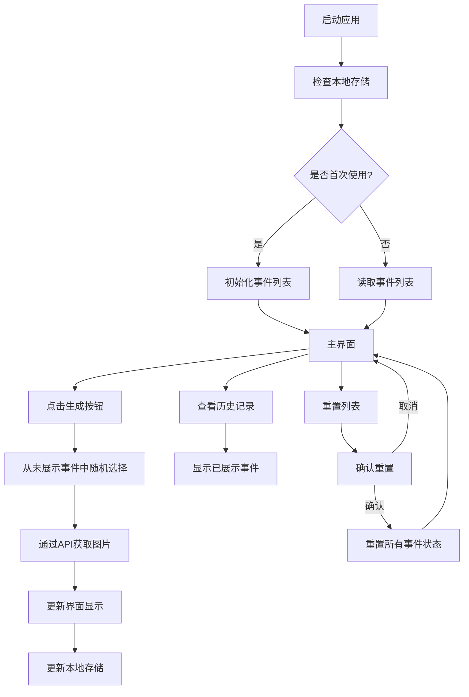

# 随机生成幸福事件 UniApp 项目需求文档 v0.1

## 一、项目概述
本项目旨在开发一个 UniApp 应用程序，通过随机生成幸福事件（如去听一首音乐、感受阳光等），为用户提供简单而愉悦的体验。用户每次点击应用界面时，系统将生成一个独特的幸福事件，并切换显示对应的图片，确保生成的事件不会重复，以增加用户的惊喜感和新鲜感。

## 二、功能需求

### （一）随机生成幸福事件
- 系统应预设一组幸福事件列表，每个事件均具有唯一性。
- 所有事件数据存储在本地storage中，包括事件描述和展示状态。
- 用户点击应用界面时，系统从尚未展示的事件中随机选择一个事件进行展示。
- 展示的事件需在本地存储中标记为已展示，确保后续不会重复展示该事件。

### （二）事件切换与图片展示
- 每次生成幸福事件时，系统应通过pollinations.ai API获取与事件相关的图片。
- 图片URL格式为：`https://image.pollinations.ai/prompt/{事件描述}`，其中{事件描述}为当前事件的描述文本。
- 图片加载过程中应显示加载状态，确保用户体验。

### （三）事件记录与重置
- 系统应在本地storage中记录已展示的幸福事件，包括事件描述、展示时间和对应的图片URL。
- 提供重置功能，允许用户在需要时清空本地存储中的展示状态，重新开始随机生成过程。

## 三、非功能需求

### （一）性能需求
- 应用程序应具备快速响应能力，点击生成事件的操作响应时间应控制在1秒以内。
- 图片加载应有合理的超时处理，避免因网络问题导致的长时间等待。

### （二）用户体验需求
- 应用界面应简洁美观，以轻松愉悦的风格呈现，符合幸福事件的主题。
- 界面设计应具有良好的交互性，操作直观，易于上手。
- 应用应支持多种设备屏幕尺寸，确保在不同设备上均能正常显示和操作。

### （三）兼容性需求
- 应用应兼容主流的移动操作系统，如 iOS 和 Android，确保用户能够在不同设备上使用。
- 应用应适应不同版本的操作系统，至少支持近3年的主流系统版本。

## 四、数据存储结构

### （一）本地存储结构
```javascript
// 幸福事件列表
happyEvents: [
  {
    id: 1,
    description: "听一首让你感动的音乐",
    isShown: false,
    shownTime: null,
    imageUrl: null
  },
  {
    id: 2,
    description: "去公园散步，感受春天的气息",
    isShown: false,
    shownTime: null,
    imageUrl: null
  },
  // 更多事件...
]
```

### （二）本地存储操作
- **初始化**：首次启动应用时，将预设的事件列表存入本地storage。
- **读取事件**：从本地storage中读取尚未展示的事件。
- **更新事件状态**：展示事件后，更新该事件的isShown、shownTime和imageUrl字段。
- **重置事件状态**：将所有事件的isShown字段重置为false，shownTime和imageUrl字段重置为null。

## 五、用户界面需求
- 应用主界面应包含一个醒目的按钮，用于触发幸福事件的生成。
- 每次生成事件后，界面应自动更新，显示事件描述和通过API获取的图片。
- 提供一个历史记录按钮，点击后可查看用户已生成的幸福事件列表。
- 提供一个重置按钮，允许用户清空已生成的事件状态，重新开始。

## 六、API集成

### Pollinations.ai图片API
- **API端点**：`https://image.pollinations.ai/prompt/{prompt}`
- **参数**：`prompt` - 事件描述文本，用于生成相关图片
- **请求方式**：GET
- **响应格式**：直接返回图片
- **错误处理**：
  - 如API请求失败，应显示默认占位图片
  - 应设置合理的超时时间，避免长时间等待

## 七、验收标准
- 应用能够随机生成幸福事件，且生成的事件不会重复。
- 每次生成事件时，能够通过pollinations.ai API获取并显示相关图片。
- 应用界面简洁美观，操作流畅，符合用户体验需求。
- 应用性能稳定，响应时间符合性能需求，图片加载有合理的超时处理。
- 应用兼容主流的移动操作系统，能够在不同设备上正常运行。
- 所有数据正确存储在本地storage中，且能够正确读取和更新。

## 八、预设幸福事件列表（示例）
1. 听一首让你感动的音乐
2. 去公园散步，感受春天的气息
3. 给一位朋友发送问候消息
4. 品尝一杯喜欢的饮料
5. 看一本有趣的书籍
6. 做15分钟的舒展运动
7. 欣赏窗外的风景
8. 写下三件今天感恩的事
9. 整理一下自己的空间
10. 尝试一个简单的新食谱
11. 观察云朵的变化
12. 闭目深呼吸5分钟
13. 回忆一个美好的回忆
14. 给自己一个小小的奖励
15. 计划一次短途旅行

## 工作流程图


## 注意事项
1. 由于使用pollinations.ai API，应用需要网络连接才能获取图片。
2. 考虑添加图片缓存机制，减少重复请求。
3. 确保URL编码事件描述文本，避免特殊字符导致API请求失败。
4. 本地存储有容量限制，应控制存储数据的大小。 